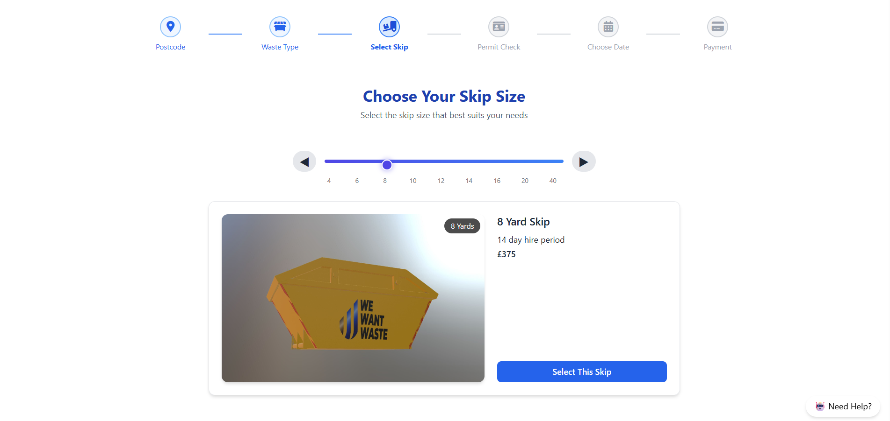

# Skip Selector

## Overview
A simple and responsive React component that allows users to compare and select skip (waste container) sizes based on common use cases and pricing. Includes visual suggestions to guide user choices using Font Awesome icons and Tailwind CSS styling.

## My Approach

- **Purpose**: The component offers an intuitive way to compare 4, 6, and 8-yard skips, commonly used for garden waste, driveways, and renovations.
- **Technologies Used**:
  - React (with Vite for fast development)
  - Tailwind CSS (for responsive and modern styling)
  - Font Awesome (via CDN for clean icons)
- **Challenges**:
  - Selecting appropriate icons to clearly represent each data point (like price, size, and suggestions) without cluttering the UI.
  - Ensuring mobile responsiveness using utility-first Tailwind classes.
- **Solutions**:
  - Used flat icons from Font Awesome to represent 💡 ideas, 📦 skip size, and 💷 pricing.
  - Organized layout with `flex` and `gap` utilities for visual clarity.
- **How to run or test the project locally**:

## How to Run

1. Clone the repo:
   ```bash
   git clone https://github.com/AzharAlbakri/skip-selector.git
   ```

2. Navigate to the project folder:
   ```bash
   cd skip-selector
   ```

3. Install dependencies:
   ```bash
   npm install
   ```

4. Start the development server:
   ```bash
   npm run dev
   ```

5. Open your browser and go to:
   ```
   http://localhost:5173
   ```

## Preview

